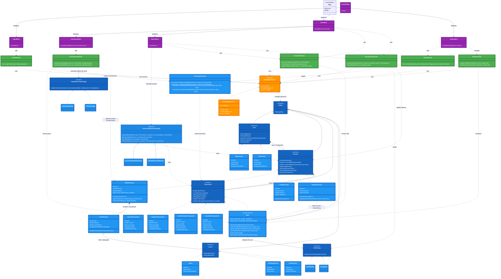

# Diagrama de Classes UML 

Este diagrama representa a arquitetura completa do `ObjectFinance`.

```mermaid
classDiagram
    %% ----------------------------------------------------
    %% CORE DOMAIN - Interfaces Base (Espaço do Problema)
    %% ----------------------------------------------------
    class Entity {
        <<interface>>
        +String getId()
    }
    class User {
        <<interface>>
        +String getName()
        +String getEmail()
        +boolean checkPassword(String password)
        +boolean isAdmin()
        +Role getRole()
    }
    class Role {
        <<enumeration>>
        REGULAR
        ADMIN
    }
    class Account {
        <<interface>>
        +String getOwnerId()
        +boolean isOwnedBy(String ownerId)
        +boolean isOwnedBySameUserAs(Account other)
        +double getBalance()
        +String getAccountType()
        +String getDisplaySummary()
        +process(Transaction t)
    }
    class Transaction {
        <<interface>>
        +double getAmount()
        +LocalDateTime getDate()
        +String getDescription()
        +String getAccountId()
        +boolean isIncome()
        +boolean belongsToAccount(String accountId)
    }
    class Asset {
        <<interface>>
        +String getTicker()
        +String getName()
    }
    class Bank {
        <<Single Instance>>
        -Map~YearMonth, Double~ yieldRates
        -Map~String, TaxStrategy~ operationStrategies
        +double getYieldRate(YearMonth month)
        +void setYieldRate(YearMonth month, double rate)
        +double operationCost(double amount, String type)
        +void setOperationTax(String type, double rate)
        -double randomRate()
        -generateMissingRatesUpTo(YearMonth target)
    }
    Entity <|-- User
    Entity <|-- Account
    Entity <|-- Transaction
    Entity <|-- Asset
    Entity <|-- Bank

    %% ----------------------------------------------------
    %% DOMAIN - Implementações de Entidades
    %% ----------------------------------------------------
    class RegularUser {
        -String id
        -String name
        -String email
        -String passwordHash
    }
    class AdminUser {
        -String id
        -String name
        -String email
        -String passwordHash
    }
    User <|.. RegularUser
    User <|.. AdminUser

    class AssetPosition {
        -Asset asset
        -double quantity
        -double averagePrice
        -LocalDateTime firstPurchaseDate
        +updatePosition(double qty, double price)
    }

    class WalletAccount {
        -String id
        -String ownerId
        -double balance
        -Map~String, AssetPosition~ portfolio
        +process(Transaction t)
        +addAsset(Asset a, double quantity, double price)
        +removeAsset(Asset a, double quantity)
    }
    class CreditAccount {
        -String id
        -String ownerId
        -double balance
        -double creditLimit
        +process(Transaction t)
    }
    class SavingsAccount {
        -String id
        -String ownerId
        -double balance
        +process(Transaction t)
        +applyMonthlyYield(YearMonth month, Bank bank)
    }
    Account <|.. WalletAccount
    Account <|.. CreditAccount
    Account <|.. SavingsAccount

    class Stock {
        -String id
        -String ticker
        -String companyName
    }
    class RealEstateFund {
        -String id
        -String ticker
        -String sector
    }
    class FixedIncome {
        -String id
        -String ticker
        -double fixedYield
    }
    Asset <|.. Stock
    Asset <|.. RealEstateFund
    Asset <|.. FixedIncome

    class IncomeTransaction {
        -String id
        -double amount
        -String accountId
        -String description
        -LocalDateTime date
    }
    class ExpenseTransaction {
        -String id
        -double amount
        -String accountId
        -String description
        -LocalDateTime date
    }
    class AssetPurchaseTransaction {
        -String id
        -double amount
        -String assetId
        -double quantity
        -String accountId
        -LocalDateTime date
    }
    class AssetSaleTransaction {
        -String id
        -double amount
        -String assetId
        -double quantity
        -String accountId
        -LocalDateTime date
    }
    Transaction <|.. IncomeTransaction
    Transaction <|.. ExpenseTransaction
    Transaction <|.. AssetPurchaseTransaction
    Transaction <|.. AssetSaleTransaction

    %% Relacionamentos Estruturais do Domínio
    User "1" *-- "*" Account : owns / Composição
    Account "1" *-- "*" Transaction : history / Composição
    WalletAccount "1" *-- "*" AssetPosition : portfolio / Composição
    AssetPosition "1" o-- "1" Asset : refers / Agregação
    SavingsAccount ..> Bank : requests yield / Dependência

    %% ----------------------------------------------------
    %% PADRÕES DE PROJETO (Design Patterns)
    %% ----------------------------------------------------
    class TaxStrategy {
        <<interface>>
        +double calculateTax(double amount)
    }
    class StandardTax
    class ExemptTax
    TaxStrategy <|.. StandardTax
    TaxStrategy <|.. ExemptTax
    Bank --> TaxStrategy : delegates fee calc

    class CapitalGainsTaxStrategy {
        <<interface>>
        +double calculateTax(Asset asset, double totalSale, double profit, int holdingDays)
    }
    class StockTaxStrategy
    class FIITaxStrategy
    CapitalGainsTaxStrategy <|.. StockTaxStrategy
    CapitalGainsTaxStrategy <|.. FIITaxStrategy

    class TransactionFactory {
        +Transaction createIncome(double amount, String accId, String desc)
        +Transaction createExpense(double amount, String accId, String desc)
        +Transaction createAssetPurchase(double amount, String assetId, double qty, String accId)
        +Transaction createAssetSale(double amount, String assetId, double qty, String accId)
    }
    TransactionFactory ..> Transaction : creates (instancia)

    class FinancialStatementTemplate {
        <<abstract>>
        +generateReport(User user, List~Account~ accounts, List~Transaction~ transactions)
        #formatHeader(User user, List~Account~ accounts)
        #formatBody(List~Transaction~ transactions)
        #formatFooter(List~Account~ accounts, List~Transaction~ transactions)
    }
    class AccountDetailedStatement
    class GlobalBalanceStatement
    FinancialStatementTemplate <|-- AccountDetailedStatement
    FinancialStatementTemplate <|-- GlobalBalanceStatement
    FinancialStatementTemplate ..> Account : reads
    FinancialStatementTemplate ..> Transaction : reads

    %% ----------------------------------------------------
    %% INFRAESTRUTURA - Persistência (O Espaço da Solução)
    %% ----------------------------------------------------
    class DataRepository~T~ {
        <<interface>>
        +save(T entity)
        +T findById(String id)
        +List~T~ findAll()
    }
    class JsonRepository~T~ {
        -String filePath
        +save(T entity)
        +T findById(String id)
        +List~T~ findAll()
    }
    DataRepository <|.. JsonRepository
    DataRepository ..> Entity : manages (gerencia)

    %% ----------------------------------------------------
    %% CASOS DE USO (Services / Application Layer)
    %% ----------------------------------------------------
    class AuthUseCase {
        +User login(String email, String password)
    }
    class UserUseCase {
        +User createUser(String name, String email, String password, boolean isAdmin)
    }
    class AccountUseCase {
        +Account createAccount(User user, String type)
        +List~Account~ listUserAccounts(User user)
        +applyYield(SavingsAccount acc, YearMonth month)
    }
    class TransactionUseCase {
        +void transfer(Account from, Account to, double amount, TaxStrategy tax)
        +void deposit(Account to, double amount)
    }
    class BankUseCase {
        +updateYieldRate(YearMonth month, double rate)
        +updateOperationTax(String operation, double rate)
    }
    class InvestmentUseCase {
        +void buyAsset(WalletAccount acc, String ticker, double quantity)
        +void sellAsset(WalletAccount acc, String ticker, double quantity)
    }
    
    %% Casos de uso dependem do Repositório Abstrato (Inversão de Dependência)
    AuthUseCase ..> DataRepository : uses
    UserUseCase ..> DataRepository : uses
    AccountUseCase ..> DataRepository : uses
    TransactionUseCase ..> DataRepository : uses
    BankUseCase ..> DataRepository : uses
    InvestmentUseCase ..> DataRepository : uses (Assets)
    
    %% Os Casos de uso conversam com o Bank e Orquestram Padrões
    BankUseCase ..> Bank : configures
    AccountUseCase ..> Bank : fetches yield
    TransactionUseCase ..> TransactionFactory : triggers
    TransactionUseCase ..> TaxStrategy : applies
    TransactionUseCase ..> Account : updates balance
    
    InvestmentUseCase ..> Bank : fetches prices
    InvestmentUseCase ..> TransactionFactory : triggers purchase/sale
    InvestmentUseCase ..> CapitalGainsTaxStrategy : calculates imposto de renda
    InvestmentUseCase ..> WalletAccount : updates portfolio (AssetPosition)

    %% ----------------------------------------------------
    %% INTERFACE DE USUÁRIO (View Layer / Console)
    %% ----------------------------------------------------
    class ConsoleView {
        +start()
    }
    class LoginMenu {
        +showMenu()
    }
    class UserMenu {
        +showMenu(User session)
    }
    class AdminMenu {
        +showMenu(AdminUser session)
    }
    class InvestmentMenu {
        +showMenu(WalletAccount sessionAccount)
    }
    class ReportMenu {
        +showMenu()
    }
    
    %% A MainView delega para os sub-menus
    ConsoleView --> LoginMenu : delegates
    ConsoleView --> UserMenu : delegates
    ConsoleView --> AdminMenu : delegates
    UserMenu --> InvestmentMenu : delegates
    UserMenu --> ReportMenu : delegates

    %% Os Menus comunicam-se EXCLUSIVAMENTE com os Casos de Uso
    LoginMenu ..> AuthUseCase : calls
    UserMenu ..> AccountUseCase : calls
    UserMenu ..> TransactionUseCase : calls
    ReportMenu ..> FinancialStatementTemplate : calls (gera extrato)
    ReportMenu ..> AccountUseCase : calls
    ReportMenu ..> TransactionUseCase : calls
    AdminMenu ..> UserUseCase : calls
    AdminMenu ..> BankUseCase : manages
    InvestmentMenu ..> InvestmentUseCase : calls

    %% ----------------------------------------------------
    %% CORES E SEPARAÇÃO VISUAL DAS CAMADAS
    %% ----------------------------------------------------
    classDef domain fill:#e3f2fd,stroke:#1565c0,stroke-width:2px,color:#000
    classDef usecase fill:#e8f5e9,stroke:#2e7d32,stroke-width:2px,color:#000
    classDef infra fill:#fff3e0,stroke:#ef6c00,stroke-width:2px,color:#000
    classDef view fill:#f3e5f5,stroke:#7b1fa2,stroke-width:2px,color:#000

    %% Aplicando as cores diretamente nas classes
    %% DOMAIN - INTERFACES (Azul Escuro)
    style Entity fill:#1565c0,stroke:#0d47a1,stroke-width:2px,color:#fff
    style User fill:#1565c0,stroke:#0d47a1,stroke-width:2px,color:#fff
    style Account fill:#1565c0,stroke:#0d47a1,stroke-width:2px,color:#fff
    style Transaction fill:#1565c0,stroke:#0d47a1,stroke-width:2px,color:#fff
    style Asset fill:#1565c0,stroke:#0d47a1,stroke-width:2px,color:#fff
    style TaxStrategy fill:#1565c0,stroke:#0d47a1,stroke-width:2px,color:#fff
    style CapitalGainsTaxStrategy fill:#1565c0,stroke:#0d47a1,stroke-width:2px,color:#fff

    %% DOMAIN - CLASSES ABSTRATAS (Azul Médio com Borda Tracejada)
    style FinancialStatementTemplate fill:#1e88e5,stroke:#0d47a1,stroke-width:2px,stroke-dasharray: 5 5,color:#fff

    %% DOMAIN - IMPLEMENTAÇÕES CONCRETAS E OUTROS (Azul Padrão)
    style Bank fill:#2196f3,stroke:#0d47a1,stroke-width:2px,color:#fff
    style RegularUser fill:#2196f3,stroke:#0d47a1,stroke-width:2px,color:#fff
    style AdminUser fill:#2196f3,stroke:#0d47a1,stroke-width:2px,color:#fff
    style AssetPosition fill:#2196f3,stroke:#0d47a1,stroke-width:2px,color:#fff
    style WalletAccount fill:#2196f3,stroke:#0d47a1,stroke-width:2px,color:#fff
    style CreditAccount fill:#2196f3,stroke:#0d47a1,stroke-width:2px,color:#fff
    style SavingsAccount fill:#2196f3,stroke:#0d47a1,stroke-width:2px,color:#fff
    style Stock fill:#2196f3,stroke:#0d47a1,stroke-width:2px,color:#fff
    style RealEstateFund fill:#2196f3,stroke:#0d47a1,stroke-width:2px,color:#fff
    style FixedIncome fill:#2196f3,stroke:#0d47a1,stroke-width:2px,color:#fff
    style IncomeTransaction fill:#2196f3,stroke:#0d47a1,stroke-width:2px,color:#fff
    style ExpenseTransaction fill:#2196f3,stroke:#0d47a1,stroke-width:2px,color:#fff
    style AssetPurchaseTransaction fill:#2196f3,stroke:#0d47a1,stroke-width:2px,color:#fff
    style AssetSaleTransaction fill:#2196f3,stroke:#0d47a1,stroke-width:2px,color:#fff
    style StandardTax fill:#2196f3,stroke:#0d47a1,stroke-width:2px,color:#fff
    style ExemptTax fill:#2196f3,stroke:#0d47a1,stroke-width:2px,color:#fff
    style StockTaxStrategy fill:#2196f3,stroke:#0d47a1,stroke-width:2px,color:#fff
    style FIITaxStrategy fill:#2196f3,stroke:#0d47a1,stroke-width:2px,color:#fff
    style TransactionFactory fill:#2196f3,stroke:#0d47a1,stroke-width:2px,color:#fff
    style AccountDetailedStatement fill:#2196f3,stroke:#0d47a1,stroke-width:2px,color:#fff
    style GlobalBalanceStatement fill:#2196f3,stroke:#0d47a1,stroke-width:2px,color:#fff

    style AuthUseCase fill:#4caf50,stroke:#1b5e20,stroke-width:2px,color:#fff
    style UserUseCase fill:#4caf50,stroke:#1b5e20,stroke-width:2px,color:#fff
    style AccountUseCase fill:#4caf50,stroke:#1b5e20,stroke-width:2px,color:#fff
    style TransactionUseCase fill:#4caf50,stroke:#1b5e20,stroke-width:2px,color:#fff
    style BankUseCase fill:#4caf50,stroke:#1b5e20,stroke-width:2px,color:#fff
    style InvestmentUseCase fill:#4caf50,stroke:#1b5e20,stroke-width:2px,color:#fff

    style DataRepository fill:#ff9800,stroke:#e65100,stroke-width:2px,color:#fff
    style JsonRepository fill:#ff9800,stroke:#e65100,stroke-width:2px,color:#fff

    style ConsoleView fill:#9c27b0,stroke:#4a148c,stroke-width:2px,color:#fff
    style LoginMenu fill:#9c27b0,stroke:#4a148c,stroke-width:2px,color:#fff
    style UserMenu fill:#9c27b0,stroke:#4a148c,stroke-width:2px,color:#fff
    style AdminMenu fill:#9c27b0,stroke:#4a148c,stroke-width:2px,color:#fff
    style InvestmentMenu fill:#9c27b0,stroke:#4a148c,stroke-width:2px,color:#fff
    style ReportMenu fill:#9c27b0,stroke:#4a148c,stroke-width:2px,color:#fff
```

> **Dica:** Você pode copiar e colar esse código no [Mermaid Live Editor](https://mermaid.live).
