# Relatório Técnico de Arquitetura - ObjectFinance

## 1. Repositório
**Link do Repositório Git:** [https://github.com/Droppicode/saFinance](https://github.com/Droppicode/saFinance)

## 2. Mapeamento do Domínio do Problema e Justificativa Semântica

O **ObjectFinance** é um simulador de ecossistema bancário digital e de gestão de investimentos (*Wealth Management*). O domínio central do problema consiste em fornecer a usuários uma plataforma para gerenciar e diversificar seu patrimônio financeiro por meio de múltiplas contas (Contas Corrente/Carteira, Crédito e Poupança). O sistema deve lidar não apenas com transações cotidianas (receitas, despesas e transferências tarifadas), mas também com a negociação de ativos no mercado financeiro (Ações, Fundos Imobiliários e Renda Fixa). Isso implica rastrear a custódia, apurar o preço médio de aquisição e, em eventos de venda, calcular os ganhos de capital (lucro) aplicando diferentes estratégias de retenção de impostos, de acordo com as regras governamentais e a política tarifária da instituição (Banco).

As entidades escolhidas para compor o núcleo (`core.domain`) foram desenhadas para refletir fielmente os conceitos do mundo real:

*   **`User` (e sub-tipos `RegularUser`, `AdminUser`):** Representam as pessoas físicas (atores) da instituição financeira. A separação semântica justifica-se pela distinção de responsabilidades: usuários comuns operam o próprio patrimônio, enquanto administradores gerenciam as regras macroeconômicas do banco.
*   **`Account` (e sub-tipos `WalletAccount`, `CreditAccount`, `SavingsAccount`):** Representam os diferentes veículos de alocação de saldo. Semanticamente, a `WalletAccount` atua de forma mista como conta corrente e carteira de corretora (custódia); a `CreditAccount` lida com saldos devedores limitados; e a `SavingsAccount` modela capital sujeito a rendimentos mensais.
*   **`Transaction` (e sub-tipos):** Representam eventos financeiros puros (fatos contábeis). Semanticamente, atuam como evidências históricas de movimentação (entradas, saídas, pagamento de taxas, compra/venda de ativos) que justificam qualquer variação no patrimônio das contas.
*   **`Asset` (e sub-tipos `Stock`, `RealEstateFund`, `FixedIncome`):** Representam os instrumentos financeiros reais disponíveis para negociação no mercado, separando a essência do produto (como Ticker e Setor) de quem o possui.
*   **`AssetPosition`:** Representa a posse. É o vínculo direto entre uma `WalletAccount` e um `Asset`, justificando a necessidade de registrar não apenas a quantidade possuída, mas o histórico do custo de aquisição (preço médio) exigido para a tributação.
*   **`Bank`:** Representa a instituição mantenedora central. Justifica-se como a entidade soberana que dita as taxas de juros (`yieldRates`) e tributações (`operationTaxes`) que regem todo o ecossistema.

## 3. Diagrama de Classes UML Completo

*(Nota: O diagrama abaixo reflete a arquitetura global projetada. A validação técnica do código atual (`src/main/java/.../core/domain`) confirma que os blocos centrais — interfaces essenciais, segregação de contas e o mecanismo central de processamento imutável de transações (padrão Wither) — já estão operantes conforme idealizado na base de domínio).*

```mermaid
classDiagram
    %% ----------------------------------------------------
    %% CORE DOMAIN - Interfaces Base (Espaço do Problema)
    %% ----------------------------------------------------
    class Entity {
        <<interface>>
        +String getId()
    }
    class User {
        <<interface>>
        +String getName()
        +String getEmail()
        +boolean checkPassword(String password)
        +boolean isAdmin()
        +Role getRole()
    }
    class Role {
        <<enumeration>>
        REGULAR
        ADMIN
    }
    class Account {
        <<interface>>
        +String getOwnerId()
        +boolean isOwnedBy(String ownerId)
        +boolean isOwnedBySameUserAs(Account other)
        +double getBalance()
        +String getAccountType()
        +String getDisplaySummary()
        +process(Transaction t)
    }
    class Transaction {
        <<interface>>
        +double getAmount()
        +LocalDateTime getDate()
        +String getDescription()
        +String getAccountId()
        +boolean isIncome()
        +boolean belongsToAccount(String accountId)
    }
    class Asset {
        <<interface>>
        +String getTicker()
        +String getName()
    }
    class Bank {
        <<Single Instance>>
        -Map~YearMonth, Double~ yieldRates
        -Map~String, TaxStrategy~ operationStrategies
        +double getYieldRate(YearMonth month)
        +void setYieldRate(YearMonth month, double rate)
        +double operationCost(double amount, String type)
        +void setOperationTax(String type, double rate)
        -double randomRate()
        -generateMissingRatesUpTo(YearMonth target)
    }
    Entity <|-- User
    Entity <|-- Account
    Entity <|-- Transaction
    Entity <|-- Asset
    Entity <|-- Bank

    %% ----------------------------------------------------
    %% DOMAIN - Implementações de Entidades
    %% ----------------------------------------------------
    class RegularUser {
        -String id
        -String name
        -String email
        -String passwordHash
        -Role role
    }
    class AdminUser {
        -String id
        -String name
        -String email
        -String passwordHash
        -Role role
    }
    User <|.. RegularUser
    User <|.. AdminUser

    class AssetPosition {
        -Asset asset
        -double quantity
        -double averagePrice
        -LocalDateTime firstPurchaseDate
        +updatePosition(double qty, double price)
    }

    class WalletAccount {
        -String id
        -String ownerId
        -double balance
        -Map~String, AssetPosition~ portfolio
        +process(Transaction t) Account
        +addAsset(Asset a, double quantity, double price)
        +removeAsset(Asset a, double quantity)
        +withPortfolio(Map portfolio) WalletAccount
    }
    class CreditAccount {
        -String id
        -String ownerId
        -double balance
        -double creditLimit
        +process(Transaction t) Account
    }
    class SavingsAccount {
        -String id
        -String ownerId
        -double balance
        +process(Transaction t) Account
        +applyMonthlyYield(YearMonth month, Bank bank)
    }
    Account <|.. WalletAccount
    Account <|.. CreditAccount
    Account <|.. SavingsAccount

    class Stock {
        -String id
        -String ticker
        -String companyName
    }
    class RealEstateFund {
        -String id
        -String ticker
        -String sector
    }
    class FixedIncome {
        -String id
        -String ticker
        -double fixedYield
    }
    Asset <|.. Stock
    Asset <|.. RealEstateFund
    Asset <|.. FixedIncome

    class IncomeTransaction {
        -String id
        -double amount
        -String accountId
        -String description
        -LocalDateTime date
    }
    class ExpenseTransaction {
        -String id
        -double amount
        -String accountId
        -String description
        -LocalDateTime date
    }
    class AssetPurchaseTransaction {
        -String id
        -double amount
        -String assetId
        -double quantity
        -String accountId
        -LocalDateTime date
    }
    class AssetSaleTransaction {
        -String id
        -double amount
        -String assetId
        -double quantity
        -String accountId
        -LocalDateTime date
    }
    Transaction <|.. IncomeTransaction
    Transaction <|.. ExpenseTransaction
    Transaction <|.. AssetPurchaseTransaction
    Transaction <|.. AssetSaleTransaction

    %% Relacionamentos Estruturais do Domínio
    User "1" *-- "*" Account : owns / Composição
    Account "1" *-- "*" Transaction : history / Composição
    WalletAccount "1" *-- "*" AssetPosition : portfolio / Composição
    AssetPosition "1" o-- "1" Asset : refers / Agregação
    SavingsAccount ..> Bank : requests yield / Dependência

    %% ----------------------------------------------------
    %% PADRÕES DE PROJETO (Design Patterns)
    %% ----------------------------------------------------
    class TaxStrategy {
        <<interface>>
        +double calculateTax(double amount, Bank bank)
    }
    class StandardTax
    class ExemptTax
    TaxStrategy <|.. StandardTax
    TaxStrategy <|.. ExemptTax
    TaxStrategy ..> Bank : reads tax rates

    class CapitalGainsTaxStrategy {
        <<interface>>
        +double calculateTax(Asset asset, double totalSale, double profit, int holdingDays)
    }
    class StockTaxStrategy
    class FIITaxStrategy
    CapitalGainsTaxStrategy <|.. StockTaxStrategy
    CapitalGainsTaxStrategy <|.. FIITaxStrategy

    class TransactionFactory {
        +Transaction createIncome(double amount, String accId, String desc)
        +Transaction createExpense(double amount, String accId, String desc)
        +Transaction createAssetPurchase(double amount, String assetId, double qty, String accId)
        +Transaction createAssetSale(double amount, String assetId, double qty, String accId)
    }
    TransactionFactory ..> Transaction : creates (instancia)

    class UserVisitor~T~ {
        <<interface>>
        +visitAdmin(AdminUser admin) T
        +visitRegular(RegularUser regular) T
    }
    User ..> UserVisitor : accept()

    class FinancialStatementTemplate {
        <<abstract>>
        +generateReport(User user, List~Account~ accounts, List~Transaction~ transactions)
        #formatHeader(User user, List~Account~ accounts)
        #formatBody(List~Transaction~ transactions)
        #formatFooter(List~Account~ accounts, List~Transaction~ transactions)
    }
    class AccountDetailedStatement
    class GlobalBalanceStatement
    FinancialStatementTemplate <|-- AccountDetailedStatement
    FinancialStatementTemplate <|-- GlobalBalanceStatement
    FinancialStatementTemplate ..> Account : reads
    FinancialStatementTemplate ..> Transaction : reads

    %% ----------------------------------------------------
    %% INFRAESTRUTURA - Persistência (O Espaço da Solução)
    %% ----------------------------------------------------
    class DataRepository~T~ {
        <<interface>>
        +save(T entity)
        +T findById(String id)
        +List~T~ findAll()
    }
    class JsonRepository~T~ {
        -String filePath
        +save(T entity)
        +T findById(String id)
        +List~T~ findAll()
    }
    DataRepository <|.. JsonRepository
    DataRepository ..> Entity : manages (gerencia)

    %% ----------------------------------------------------
    %% CASOS DE USO (Services / Application Layer)
    %% ----------------------------------------------------
    class AuthUseCase {
        +User login(String email, String password)
    }
    class UserUseCase {
        +User createUser(String name, String email, String password, boolean isAdmin)
    }
    class AccountUseCase {
        +Account createAccount(User user, String type)
        +List~Account~ listUserAccounts(User user)
        +applyYield(SavingsAccount acc, YearMonth month)
    }
    class TransactionUseCase {
        +void transfer(Account from, Account to, double amount, TaxStrategy tax)
        +void deposit(Account to, double amount)
    }
    class BankUseCase {
        +updateYieldRate(YearMonth month, double rate)
        +updateOperationTax(String operation, double rate)
        +updateAssetPrice(String ticker, double newPrice)
    }
    class InvestmentUseCase {
        +void buyAsset(WalletAccount acc, String ticker, double quantity)
        +void sellAsset(WalletAccount acc, String ticker, double quantity)
    }
    
    %% Casos de uso dependem do Repositório Abstrato (Inversão de Dependência)
    AuthUseCase ..> DataRepository : uses
    UserUseCase ..> DataRepository : uses
    AccountUseCase ..> DataRepository : uses
    TransactionUseCase ..> DataRepository : uses
    BankUseCase ..> DataRepository : uses
    InvestmentUseCase ..> DataRepository : uses (Assets)
    
    %% Os Casos de uso conversam com o Bank e Orquestram Padrões
    BankUseCase ..> Bank : configures
    AccountUseCase ..> Bank : fetches yield
    TransactionUseCase ..> TransactionFactory : triggers
    TransactionUseCase ..> TaxStrategy : applies
    TransactionUseCase ..> Account : updates balance
    
    InvestmentUseCase ..> Bank : fetches prices
    InvestmentUseCase ..> TransactionFactory : triggers purchase/sale
    InvestmentUseCase ..> CapitalGainsTaxStrategy : calculates imposto de renda
    InvestmentUseCase ..> WalletAccount : updates portfolio (AssetPosition)

    %% ----------------------------------------------------
    %% INTERFACE DE USUÁRIO (View Layer / Console)
    %% ----------------------------------------------------
    class ConsoleView {
        +start()
    }
    class BaseMenu {
        <<interface>>
        +List~String~ getOptions()
        +renderHeader(PromptService promptService)
        +handleInput(PromptService promptService) BaseMenu
    }
    class AbstractMenu {
        <<abstract>>
        -Map~String, MenuCommand~ commands
        #registerCommand(String key, String label, Function action)
        #printHeader(PromptService promptService)
    }
    class MenuContext
    
    BaseMenu <|.. AbstractMenu

    class LoginMenu
    class UserMenu
    class AdminMenu
    class InvestmentMenu
    class ReportMenu
    
    AbstractMenu <|-- LoginMenu
    AbstractMenu <|-- UserMenu
    AbstractMenu <|-- AdminMenu
    AbstractMenu <|-- InvestmentMenu
    AbstractMenu <|-- ReportMenu
    
    %% A MainView delega para os sub-menus
    ConsoleView --> LoginMenu : delegates
    ConsoleView --> UserMenu : delegates
    ConsoleView --> AdminMenu : delegates
    UserMenu --> InvestmentMenu : delegates
    UserMenu --> ReportMenu : delegates

    %% Os Menus comunicam-se EXCLUSIVAMENTE com os Casos de Uso
    LoginMenu ..> AuthUseCase : calls
    UserMenu ..> AccountUseCase : calls
    UserMenu ..> TransactionUseCase : calls
    ReportMenu ..> FinancialStatementTemplate : calls (gera extrato)
    ReportMenu ..> AccountUseCase : calls
    ReportMenu ..> TransactionUseCase : calls
    AdminMenu ..> UserUseCase : calls
    AdminMenu ..> BankUseCase : manages
    InvestmentMenu ..> InvestmentUseCase : calls

    %% ----------------------------------------------------
    %% CORES E SEPARAÇÃO VISUAL DAS CAMADAS
    %% ----------------------------------------------------
    classDef domain fill:#e3f2fd,stroke:#1565c0,stroke-width:2px,color:#000
    classDef usecase fill:#e8f5e9,stroke:#2e7d32,stroke-width:2px,color:#000
    classDef infra fill:#fff3e0,stroke:#ef6c00,stroke-width:2px,color:#000
    
    %% DOMAIN - INTERFACES (Azul Escuro)
    style Entity fill:#1565c0,stroke:#0d47a1,stroke-width:2px,color:#fff
    style User fill:#1565c0,stroke:#0d47a1,stroke-width:2px,color:#fff
    style Account fill:#1565c0,stroke:#0d47a1,stroke-width:2px,color:#fff
    style Transaction fill:#1565c0,stroke:#0d47a1,stroke-width:2px,color:#fff
    style Asset fill:#1565c0,stroke:#0d47a1,stroke-width:2px,color:#fff
    style TaxStrategy fill:#1565c0,stroke:#0d47a1,stroke-width:2px,color:#fff
    style CapitalGainsTaxStrategy fill:#1565c0,stroke:#0d47a1,stroke-width:2px,color:#fff
    style UserVisitor fill:#1565c0,stroke:#0d47a1,stroke-width:2px,color:#fff

    %% DOMAIN - CLASSES ABSTRATAS (Azul Médio com Borda Tracejada)
    style FinancialStatementTemplate fill:#1e88e5,stroke:#0d47a1,stroke-width:2px,stroke-dasharray: 5 5,color:#fff

    %% DOMAIN - IMPLEMENTAÇÕES CONCRETAS E OUTROS (Azul Padrão)
    style Bank fill:#2196f3,stroke:#0d47a1,stroke-width:2px,color:#fff
    style RegularUser fill:#2196f3,stroke:#0d47a1,stroke-width:2px,color:#fff
    style AdminUser fill:#2196f3,stroke:#0d47a1,stroke-width:2px,color:#fff
    style AssetPosition fill:#2196f3,stroke:#0d47a1,stroke-width:2px,color:#fff
    style WalletAccount fill:#2196f3,stroke:#0d47a1,stroke-width:2px,color:#fff
    style CreditAccount fill:#2196f3,stroke:#0d47a1,stroke-width:2px,color:#fff
    style SavingsAccount fill:#2196f3,stroke:#0d47a1,stroke-width:2px,color:#fff
    style Stock fill:#2196f3,stroke:#0d47a1,stroke-width:2px,color:#fff
    style RealEstateFund fill:#2196f3,stroke:#0d47a1,stroke-width:2px,color:#fff
    style FixedIncome fill:#2196f3,stroke:#0d47a1,stroke-width:2px,color:#fff
    style IncomeTransaction fill:#2196f3,stroke:#0d47a1,stroke-width:2px,color:#fff
    style ExpenseTransaction fill:#2196f3,stroke:#0d47a1,stroke-width:2px,color:#fff
    style AssetPurchaseTransaction fill:#2196f3,stroke:#0d47a1,stroke-width:2px,color:#fff
    style AssetSaleTransaction fill:#2196f3,stroke:#0d47a1,stroke-width:2px,color:#fff
    style StandardTax fill:#2196f3,stroke:#0d47a1,stroke-width:2px,color:#fff
    style ExemptTax fill:#2196f3,stroke:#0d47a1,stroke-width:2px,color:#fff
    style StockTaxStrategy fill:#2196f3,stroke:#0d47a1,stroke-width:2px,color:#fff
    style FIITaxStrategy fill:#2196f3,stroke:#0d47a1,stroke-width:2px,color:#fff
    style TransactionFactory fill:#2196f3,stroke:#0d47a1,stroke-width:2px,color:#fff
    style AccountDetailedStatement fill:#2196f3,stroke:#0d47a1,stroke-width:2px,color:#fff
    style GlobalBalanceStatement fill:#2196f3,stroke:#0d47a1,stroke-width:2px,color:#fff

    style AuthUseCase fill:#e8f5e9,stroke:#2e7d32,stroke-width:2px,color:#000
    style UserUseCase fill:#e8f5e9,stroke:#2e7d32,stroke-width:2px,color:#000
    style AccountUseCase fill:#e8f5e9,stroke:#2e7d32,stroke-width:2px,color:#000
    style TransactionUseCase fill:#e8f5e9,stroke:#2e7d32,stroke-width:2px,color:#000
    style BankUseCase fill:#e8f5e9,stroke:#2e7d32,stroke-width:2px,color:#000
    style InvestmentUseCase fill:#e8f5e9,stroke:#2e7d32,stroke-width:2px,color:#000

    style DataRepository fill:#fff3e0,stroke:#ef6c00,stroke-width:2px,color:#000
    style JsonRepository fill:#fff3e0,stroke:#ef6c00,stroke-width:2px,color:#000

    style ConsoleView fill:#f3e5f5,stroke:#7b1fa2,stroke-width:2px,color:#000
    style BaseMenu fill:#f3e5f5,stroke:#7b1fa2,stroke-width:2px,color:#000
    style AbstractMenu fill:#ce93d8,stroke:#6a1b9a,stroke-width:2px,color:#000
    style MenuContext fill:#e1bee7,stroke:#8e24aa,stroke-width:2px,color:#000
    style LoginMenu fill:#9c27b0,stroke:#4a148c,stroke-width:2px,color:#fff
    style UserMenu fill:#9c27b0,stroke:#4a148c,stroke-width:2px,color:#fff
    style AdminMenu fill:#9c27b0,stroke:#4a148c,stroke-width:2px,color:#fff
    style InvestmentMenu fill:#9c27b0,stroke:#4a148c,stroke-width:2px,color:#fff
    style ReportMenu fill:#9c27b0,stroke:#4a148c,stroke-width:2px,color:#fff
```



## 4. Matriz de Justificativa de Design

A arquitetura do `ObjectFinance` foi desenhada com base em princípios rigorosos de Orientação a Objetos. Abaixo detalhamos de forma direta como os padrões e heurísticas foram implementados:

### 4.1. Padrões de Projeto (GoF)

| Padrão | Onde foi aplicado? | Justificativa / Semântica |
| :--- | :--- | :--- |
| **Strategy** | `TaxStrategy`, `CapitalGainsTaxStrategy` | Isola os algoritmos de cálculo de impostos (padrão, isento, ações, FIIs). Evita múltiplos blocos de `if/else` no domínio, permitindo plugar novas regras tributárias sem quebrar as transações e o motor de contas. |
| **Factory Method** | `TransactionFactory` | Centraliza a complexidade de instanciar transações financeiras. Oculta os detalhes de inicialização (data, validações) e blinda os Casos de Uso, que interagem apenas com a abstração `Transaction`. |
| **Template Method** | `FinancialStatementTemplate` e `AbstractMenu` | No extrato, define o esqueleto algorítmico da geração dos dados. Na interface do usuário, em conjunto com o Command, o `AbstractMenu` gerencia o loop de inputs, evitando repetição de código em cada menu. |
| **Command** | `AbstractMenu` e Subclasses de Menu | Erradica estruturas condicionais gigantescas (`if/else` ou `switch/case`) nos menus. As opções são registradas como comandos (lambdas) em um mapa, garantindo o Princípio Aberto/Fechado (OCP) ao adicionar novas telas. |
| **Visitor** | `UserVisitor` | Resolve o problema de Polimorfismo Duplo (Double Dispatch). Permite estender as opções de menus baseadas no tipo de usuário logado (Admin vs Regular) sem poluir as entidades de domínio com a regra de interface, e eliminando verificações de cast ou `instanceof`. |

### 4.2. Princípios S.O.L.I.D. e Acrônimo TRUE

O design do código orienta-se pela qualidade e consistência estipulada pelo Acrônimo **TRUE**:
*   **Transparent (Transparente):** As dependências são explícitas (ex: Injeção do `Repository` via construtor nos `UseCases`), tornando as consequências de qualquer mudança óbvias e previsíveis.
*   **Reasonable (Razoável):** O nível de abstração é justificado. O uso de padrões como *Command* evitou um código espaguete, trazendo um custo de mudança baixo, proporcional ao benefício de manutenção.
*   **Usable (Usável/Reutilizável):** Entidades como `WalletAccount` e lógicas de `Bank` podem ser reutilizadas perfeitamente tanto no motor transacional quanto na geração de extratos sem gambiarras.
*   **Exemplary (Exemplar):** O uso rigoroso da Imutabilidade (Wither) e a inversão de dependência de Infra definem um padrão seguro que o resto da base de código imita naturalmente.

Além disso, os preceitos essenciais do **SOLID** foram validados na arquitetura:

| Princípio | Evidência na Implementação | Benefício Alcançado |
| :--- | :--- | :--- |
| **S**RP *(Responsabilidade Única)* | Casos de Uso vs Factories | Um Caso de Uso orquestra fluxo. A Factory cria. A Strategy calcula. As responsabilidades estão perfeitamente pulverizadas, mantendo a coesão altíssima. |
| **O**CP *(Aberto/Fechado)* | Hierarquia de `Asset` | Para introduzir "Criptomoedas" no sistema, basta criar um novo `Asset` e uma nova `TaxStrategy`. A lógica central da `WalletAccount` permanece intacta (fechada para modificação, aberta para extensão). |
| **L**SP *(Substituição de Liskov)* | Métodos `.process(Transaction)` | As subclasses de `Account` honram contratos base. Qualquer conta pode ser processada uniformemente pelo polimorfismo sem quebrar o estado financeiro. |
| **I**SP *(Segregação de Interfaces)* | Diferenciação de `Tax` e `CapitalGains` | A tributação sobre venda de ativos exige parâmetros como lucros e tempo de posse, enquanto a tributação bancária é simples. A separação das interfaces não obriga contas correntes simples a dependerem de lógicas de "Home Broker". |
| **D**IP *(Inversão de Dependência)* | `DataRepository<T>` | Os Casos de Uso conversam com o "Porta" (interface abstrata). O sistema não conhece o banco de dados. A implementação JSON (`JsonRepository`) está numa camada fraca (Infra) e acoplada através da injeção de dependência. |

### 4.3. GRASP & Regras de Domínio

| Princípio / Heurística | Onde está? | Explicação Funcional |
| :--- | :--- | :--- |
| **Creator** | `TransactionFactory` | Regra direta: quem possui o conhecimento para inicializar o objeto, o cria. |
| **Controller** | `UseCases` (Layer Verde) | Coordenam as requisições que vêm dos menus da View, manipulando entidades e chamando o repositório. Protegem o domínio de vazamentos lógicos para a UI. |
| **Information Expert** | `AssetPosition` | Detém total soberania e expertise dos dados. Ela é a *única* classe que sabe calcular o Preço Médio (Average Price) quando novas cotas são adicionadas. |
| **Blindagem / Fail-Fast** | `Account.process()` / Padrão Wither | Como regra do *Domain-Driven Design (DDD)* em modelos ricos, não existem `setters` públicos anêmicos. Operações falham imediatamente ao violar a realidade (ex: falta de saldo, cota inválida). |

### 4.4. Gestão Estruturada de Falhas (Filosofia Fail-Fast)

Seguindo as diretrizes de proteger o sistema contra estados inválidos, adotamos o padrão **Fail-Fast**.

*   **Exceções de Domínio (Unchecked):** Criamos as classes `InvalidTransactionException` e `InsufficientFundsException` (estendendo de `RuntimeException`). Isso garante que, se uma `Account` tentar sacar um valor maior do que o limite, a exceção é lançada imediatamente, bloqueando a transação. O sistema de View captura o erro e informa o usuário amigavelmente, sem causar *"crashes"* ou sujar o console com *stack traces*.
*   **Isolamento de Erros de Infraestrutura (Checked):** Quando uma operação I/O falha (ex: `IOException` ao tentar ler o arquivo `.jsonl`), essa exceção é capturada *apenas* na camada do repositório (`JsonlRepository`). Ela é encapsulada em uma *Unchecked Exception* genérica, garantindo que detalhes da implementação do sistema de arquivos não vazem para o Domínio ou para o Usuário.

## 5. Guia de Execução

Este projeto foi construído utilizando **Java** e **Maven**. Siga os passos abaixo para compilar e executar o sistema no terminal:

### 5.1. Pré-requisitos
*   **Java Development Kit (JDK):** Versão 17 ou superior.
*   **Maven:** Instalado e configurado no PATH (`mvn -version` para verificar).

### 5.2. Compilação e Execução

Para compilar o código fonte, baixar as dependências e iniciar o Menu Principal Interativo, execute o seguinte comando na raiz do projeto (onde está o arquivo `pom.xml`):

```bash
# Limpa builds anteriores e compila o projeto
mvn clean compile

# Executa o sistema a partir da classe Main
mvn exec:java -Dexec.mainClass="com.safinance.Main"
```

### 5.3. Execução dos Testes Automatizados

O projeto possui uma suíte de testes unitários que valida as regras de negócio centrais (Cálculos de Impostos, Criação de Transações, Saldos e Regras Imutáveis). Para rodar os testes:

```bash
mvn test
```

> **Dica:** Os dados persistidos da aplicação são salvos localmente na pasta `data/` em formato `.json` por padrão. Se desejar resetar o banco de dados da aplicação para testar com um ambiente limpo, basta apagar o conteúdo ou deletar os arquivos dentro do diretório `data/`.

## 6. Divisão Detalhada de Tarefas

Conforme exigido pelos critérios de avaliação do projeto, o desenvolvimento foi dividido colaborativamente. Atribuímos lideranças técnicas focadas nas diferentes frentes da arquitetura para garantir eficiência e domínio pleno do código:

| Membro do Grupo | RA | Responsabilidades Principais (Frentes de Atuação) |
| :--- | :--- | :--- |
| **[Marcos Menezes Nunes]** | [193438] | **Arquitetura e Integração:** Inicialização da persistência e do Adaptador de Tipos Polimórficos (Gson) para preservação de herança no JSON. Estruturação das classes principais, motor de relatórios (Padrão *Template Method*), e atuação como Líder Técnico na integração do código, revisão por pares e correções gerais do sistema. |
| **[João Francisco Silva Freitas]** | [281254] | **Motor Bancário e de Mercado:** Modelagem profunda da entidade `Bank` e do sistema de taxas (Padrão *Strategy*). Responsável pela atualização de rendimentos e investimentos em tempo de execução, além da persistência do Mercado para sincronização de cotações em tempo real. |
| **[Murilo Piovezana]** | [256999] | **Gestão de Investimentos e Ativos:** Desenvolvimento completo do módulo de investimentos. Design das abstrações de Ativos, implementação do menu de investimentos (Padrão *Command*) e orquestração dos fluxos complexos de transações de compra e venda, garantindo a imutabilidade do portfólio. |
| **[Vinicius Espirito Santo Mamedi]** | [184712] | **Sistema Transacional Base:** Engenharia do motor de transações primárias (Receitas, Despesas e Transferências). Encapsulamento da criação de instâncias via Padrão *Factory Method* (`TransactionFactory`), garantindo integridade de estado e validações à prova de falhas nas lógicas de saque e depósito. |
| **[Vinicius Marinheiro]** | [296073] | **Controle de Acesso e Interface:** Construção da camada de Segurança (`AuthUseCase`) e controle de sessão. Refatoração arquitetural das interfaces de usuário (`AdminMenu`, `UserMenu`, `WelcomeMenu`) aplicando separação de responsabilidades e o Padrão *Visitor* para controle de permissões dinâmicas (Admin vs Regular). |
